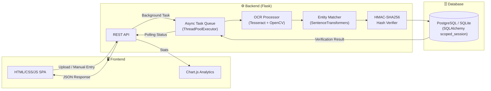

<p align="center">
  
</p>

<h1 align="center">🎓 Veri-Scholars</h1>

<p align="center">
  <strong>Authenticity Validator for Academia</strong><br/>
  A smart, scalable, and secure system to detect fake degrees &amp; forged academic certificates.
</p>

<p align="center">
  <a href="https://github.com/pranavhm25/sih-2025-Veri-Scholars/blob/main/LICENSE">
    
  </a>
  
  
  
</p>

---

## 📋 Table of Contents

- [Problem Statement](#-problem-statement)
- [Our Solution](#-our-solution)
- [Architecture](#-architecture)
- [Core Features](#-core-features)
- [Tech Stack](#-tech-stack)
- [Project Structure](#-project-structure)
- [Getting Started](#-getting-started)
- [API Reference](#-api-reference)
- [Target Users](#-target-users)
- [Impact & Benefits](#-impact--benefits)
- [Future Roadmap](#-future-roadmap)
- [Team Members](#-team-members)
- [License](#-license)

---

## 🔍 Problem Statement

The rise of fake degrees and forged academic certificates poses a serious threat to the credibility of higher education, job markets, and government schemes. Manual verification methods are slow, inconsistent, and vulnerable to corruption. To ensure academic integrity and public trust, there is a pressing need for a secure, scalable, and automated system that can detect and prevent the misuse of fraudulent certificates.

---

## 💡 Our Solution

Built for **Smart India Hackathon 2025** (Problem Statement **25029**), **Veri-Scholars** is a smart, scalable, and secure Fake Degree Verification System tailored for higher education institutions in Jharkhand. The platform combines **AI-driven OCR extraction** with **cryptographic verification** to provide a seamless and trustworthy way to validate academic credentials.

### Objectives

1. Provide a smart, reliable, and fast verification system for certificates.
2. Ensure security, scalability, and transparency in validation using **cryptographic hashes**.
3. Enable employers, institutions, and government agencies to easily verify academic records.

---

## 🏗 Architecture



---

## ✨ Core Features

| Feature | Description |
|---------|-------------|
| **📤 Upload & Verify** | Drag-and-drop interface for employers/agencies to test scanned certificates against verified records. Backed by a non-blocking **Async Task Queue** for handling heavy files. |
| **🤖 AI Extractor (OCR)** | Automatically pulls key details from unstructured documents using PyTesseract. Includes **auto-deskewing** via OpenCV to correct angled scans. |
| **🧠 Smart Entity Matching** | **Fuzzy matching** and `SentenceTransformers` gracefully handle OCR typos and resolve academic institutions (optimized for Jharkhand). |
| **📊 Anomaly Dashboard** | Comprehensive metrics via Chart.js — forgery trends, volume trackers, and real-time security alerts. |
| **🔐 Advanced Security** | **Brute-force detection** with auto-escalating IPs, strict input sanitization, and **HMAC-SHA256 keyed hashing** ensures tamper-proof integrity. |

---

## 🛠 Tech Stack

| Layer | Technologies |
|-------|-------------|
| **Frontend** | HTML5 · CSS3 (Glassmorphism & Gradients) · Vanilla JavaScript · Chart.js |
| **Backend** | Python · Flask · Flask-CORS · Flask-Limiter · Gunicorn |
| **AI / ML** | PyTesseract (OCR) · OpenCV (Image Preprocessing) · SentenceTransformers (Entity Matching) |
| **Database** | PostgreSQL (Production) · SQLite (Local) · SQLAlchemy ORM |
| **Security** | SHA-256 Cryptographic Document Hashing · Rate Limiting |

---

## 📂 Project Structure

```
sih-2025-Veri-Scholars/
│
├── frontend/                    # Client-side application
│   ├── index.html               # Main SPA entry point
│   ├── style.css                # Global styles (glassmorphism, gradients)
│   ├── script.js                # Client-side logic, navigation & demo mode
│   ├── preview.png              # Project preview screenshot
│   └── flutter.dart             # Flutter prototype reference
│
├── backend/
│   ├── ocr/                     # Flask REST API + AI verification engine
│   │   ├── app.py               # Flask server & route definitions
│   │   ├── OCRProcessor.py      # Tesseract OCR + OpenCV pipeline
│   │   ├── verifier.py          # Certificate verification logic
│   │   ├── database.py          # SQLAlchemy models & DB setup
│   │   ├── wsgi.py              # Gunicorn WSGI entry point
│   │   ├── requirements.txt     # Python dependencies
│   │   ├── certificates.db      # SQLite database
│   │   ├── static/              # Backend-specific static assets
│   │   └── templates/           # Jinja2 templates
│   └── hash/
│       └── certificates.db      # Hash verification database
│
├── flutter.dart                 # Flutter app reference
├── .gitignore
├── LICENSE                      # MIT License
└── README.md
```

---

## 🚀 Getting Started

### Demo Mode (No Backend Required)

The frontend includes a **fully functional simulation mode** — no server needed!

1. **Clone the repository**
   ```bash
   git clone https://github.com/pranavhm25/sih-2025-Veri-Scholars.git
   cd sih-2025-Veri-Scholars
   ```

2. **Open the frontend** in any modern browser
   ```bash
   # Windows
   start frontend/index.html

   # macOS
   open frontend/index.html

   # Linux
   xdg-open frontend/index.html
   ```

3. **Try it out:**
   - Go to the **Verify** tab → enter Certificate ID `JHK-2025-CS-042` and name `Aditi Sharma` for a successful verification.
   - Enter any random string to see anomaly detection in action.
   - Click **"Use Demo Account"** on the Institution Portal to explore the admin dashboard.

### Backend API (Full Mode)

> **Prerequisites:** Python 3.8+ and [Tesseract-OCR](https://github.com/tesseract-ocr/tesseract) installed on your system.

```bash
# 1. Navigate to the OCR backend
cd backend/ocr

# 2. Install dependencies
pip install -r requirements.txt

# 3. Initialise the database
python database.py

# 4. Start the Flask server
python app.py
```

The API server will start at `http://localhost:5000` and also serve the frontend at the root URL.

---

## 📡 API Reference

| Method | Endpoint | Description | Rate Limit |
|--------|----------|-------------|------------|
| `GET` | `/` | Serves the frontend SPA | — |
| `POST` | `/api/verify/manual` | Verify a certificate by ID & name | 5/min |
| `POST` | `/api/verify/upload` | Upload & verify a scanned certificate | 5/min |
| `GET` | `/api/dashboard/stats` | Get dashboard statistics (records, verifications, trust score) | — |
| `POST` | `/api/dashboard/bulk-upload` | Dynamically parse & ingest a CSV file to the database | — |

<details>
<summary><strong>📝 Example: Manual Verification</strong></summary>

**Request**
```bash
curl -X POST http://localhost:5000/api/verify/manual \
  -H "Content-Type: application/json" \
  -d '{"certificate_id": "JHK-2025-CS-042", "name": "Aditi Sharma"}'
```

**Response (Success)**
```json
{
  "success": true,
  "message": "Certificate verified successfully",
  "anomaly_reasons": [],
  "extracted_data": {
    "name": "Aditi Sharma",
    "roll_number": "CS-2025-042",
    "institution": "BIT Mesra",
    "certificate_id": "JHK-2025-CS-042"
  }
}
```

**Response (Failure)**
```json
{
  "success": false,
  "message": "Certificate verification failed",
  "anomaly_reasons": ["Name mismatch", "Certificate ID not found"],
  "extracted_data": {}
}
```
</details>

<details>
<summary><strong>📝 Example: Dashboard Stats</strong></summary>

**Request**
```bash
curl http://localhost:5000/api/dashboard/stats
```

**Response**
```json
{
  "records_issued": 12453,
  "total_verifications": 340,
  "forged_attempts": 3,
  "trust_score": 99.1,
  "total_security_alerts": 12,
  "critical_alerts": 1
}
```
</details>

---

## 🎯 Target Users

| User | Use Case |
|------|----------|
| 🏢 **Employers & HR** | Verify candidate credentials before hiring |
| 🎓 **Universities & Colleges** | Issue tamper-proof certificates and manage records |
| 📋 **Scholarship Agencies** | Validate academic eligibility for grants |
| 🏫 **Admission Offices** | Cross-verify transfer/prior-education certificates |
| 🏛 **Government Departments** | Audit academic credentials for public-sector schemes |

---

## 💪 Impact & Benefits

- 🛡️ **Protects academic integrity** and institutional reputation.
- ⚡ **Speeds up verification** for jobs, admissions, and government schemes.
- 🚫 **Prevents fraud** by ensuring only authentic credentials are accepted.
- 🤝 **Builds trust** between students, institutions, employers, and government bodies.
- 🇮🇳 **Supports Digital India** goals by enabling a transparent, future-proof education ecosystem.

---

## 🔮 Future Roadmap

- [ ] Blockchain-based immutable certificate storage
- [ ] Integration with **DigiLocker / UGC / AICTE** databases
- [ ] Deep learning–powered advanced fraud detection
- [ ] Mobile application for on-the-go verification
- [ ] Pan-India scaling beyond Jharkhand institutions

---

## 👥 Team Members

| Name | Role |
|------|------|
| **Akash Biswas** | Backend & AI/ML Model Development |
| **Arav Gupta** | Backend & AI/ML Model Development |
| **H M Pranav** | Frontend Development |
| **Dhritiraaj Bharali** | Security & Data Protection |
| **Aditi Agarwal** | Web Design (UI/UX) |
| **Hrishikesh Shetty** | App Development (Frontend) |

---

## 🤝 Contributing

1. Fork the repository
2. Create a feature branch (`git checkout -b feature/amazing-feature`)
3. Commit your changes (`git commit -m 'Add amazing feature'`)
4. Push to the branch (`git push origin feature/amazing-feature`)
5. Open a Pull Request

---

## 📄 License

This project is licensed under the **MIT License** — see the [LICENSE](LICENSE) file for details.

---

<p align="center">
  Built with ❤️ for <strong>Smart India Hackathon 2025</strong><br/>
  Problem Statement 25029: <em>"Authenticity Validator for Academia"</em><br/><br/>
  <em>Powered by the Department of Higher & Technical Education, Jharkhand</em>
</p>
